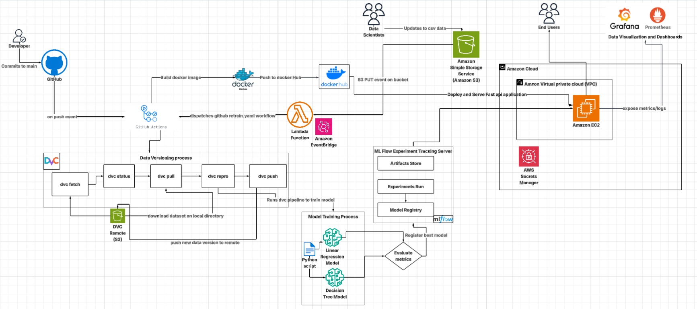

# MLOps Pipeline: DVC + MLflow + GitHub Actions on AWS (FastAPI)

> **Goal:** Automatically retrain and safely deploy a FastAPI ML service whenever **code** or **data** changes — with reproducible data/model versions, a proper model registry, and production observability.

---

## 🚀 Architecture (One-Page)

> Put your diagram at `docs/architecture.png`. (You can export from draw.io as PNG.)

**Key flow**  
- **Code path:** Developer pushes → GitHub Actions runs CI (lint/tests) → builds Docker image → pushes to Docker Hub → deploys/refreshes FastAPI on EC2.  
- **Data path:** Data scientist updates CSV in S3 → S3 **PUT** triggers **EventBridge → Lambda** → dispatches **`retrain.yml`** workflow → GitHub runner executes **DVC** (`fetch → status → pull → repro → push`) → training code logs to **MLflow** → best run is **registered** in **Model Registry** → (optional) promote to **Production** → FastAPI reloads/uses production model.  
- **Observability:** FastAPI exposes `/metrics` → **Prometheus** scrapes → **Grafana** dashboards.

**Roles**  
- **DVC**: data/pipeline versioning + retraining orchestration.  
- **MLflow**: experiment tracking + model registry (not the trainer).  
- **CI/CD**: builds images, dispatches retrain, deploys app.  
- **AWS**: S3 (data + DVC remote), EventBridge/Lambda (triggers), EC2 (serving), Secrets Manager (config).

---

## 🧰 Tech Stack
- **Training/Serving:** Python, scikit-learn, FastAPI, Uvicorn
- **Tracking/Registry:** MLflow Tracking Server + Model Registry
- **Data/Pipeline:** DVC with **S3** remote
- **CI/CD:** GitHub Actions, Docker, Docker Hub
- **Infra:** AWS S3, EventBridge, Lambda, EC2 (in VPC), Secrets Manager
- **Observability:** Prometheus, Grafana

---

## 📁 Suggested Repo Layout
```
.
├─ app/                       # FastAPI app (serving)
│  └─ main.py
├─ src/                       # Training code
│  ├─ train.py
│  └─ inference.py
├─ data/                      # DVC-tracked data directory
│  └─ housing.csv.dvc         # pointer tracked by git (not raw CSV)
├─ dvc.yaml                   # DVC pipeline stages
├─ requirements.txt
├─ Dockerfile
├─ Makefile                   # optional: handy commands
├─ .github/workflows/
│  ├─ ci.yml
│  └─ retrain.yml
├─ docs/
│  └─ architecture.png
└─ README.md
```

---

## 🔐 Secrets & Environment
Use **GitHub Actions → Settings → Secrets and variables → Actions**

**Required (typical):**
- `DOCKERHUB_USERNAME`, `DOCKERHUB_TOKEN`
- `AWS_REGION`
- If runners **don’t** have an AWS role attached: `AWS_ACCESS_KEY_ID`, `AWS_SECRET_ACCESS_KEY`
- `S3_DATA_BUCKET` (raw CSV location), `S3_DVC_BUCKET` (DVC remote)
- `MLFLOW_TRACKING_URI` (e.g., `http://mlflow.yourdomain:5000`)
- `MLFLOW_S3_BUCKET` (if MLflow artifacts in S3), optionally `MLFLOW_S3_ENDPOINT_URL`
- `GH_PAT` (if Lambda dispatches workflow via GitHub API; scope: `repo`, `workflow`)

On **EC2** (serving): place app secrets (DB URIs, registry/model name, etc.) in **AWS Secrets Manager** or instance profile/IAM role.

---

## 🗃️ DVC Setup (one-time)
```bash
# init (if not already)
dvc init

# track dataset
dvc add data/housing.csv
git add data/housing.csv.dvc .gitignore
git commit -m "Track dataset with DVC"

# add S3 remote
dvc remote add -d s3remote s3://$S3_DVC_BUCKET
dvc push                       # upload artifacts to S3

# commit DVC config so runners can pull
git add .dvc/config
git commit -m "Configure DVC S3 remote"
```

**Retrain steps run by CI:**  
```bash
dvc fetch && dvc status -r s3remote
dvc pull
dvc repro
dvc push
```

---

## 🧪 MLflow Setup
**Run server (example):**
```bash
mlflow server \
  --host 0.0.0.0 --port 5000 \
  --backend-store-uri sqlite:///mlflow.db \
  --default-artifact-root s3://$MLFLOW_S3_BUCKET/
```
> For production, use **PostgreSQL** for `--backend-store-uri`.

**Training code (snippet):**
```python
import mlflow, mlflow.sklearn
from sklearn.linear_model import LinearRegression

with mlflow.start_run(run_name="LinearRegression"):
    model = LinearRegression().fit(X_train, y_train)
    rmse = mean_squared_error(y_test, model.predict(X_test), squared=False)
    mlflow.log_metric("rmse", rmse)
    mlflow.sklearn.log_model(model, "model")

    # Register new version
    model_name = "California_Housing_Regression"
    result = mlflow.register_model(f"runs:/{mlflow.active_run().info.run_id}/model", model_name)
```
Promotion to **Staging/Production** can be manual (UI) or automated (CI step).

---

## 🧱 DVC Pipeline (`dvc.yaml` example)
```yaml
stages:
  preprocess:
    cmd: python src/train.py --step preprocess
    deps: [data/housing.csv, src/train.py]
    outs: [artifacts/clean.parquet]

  train:
    cmd: python src/train.py --step train --in artifacts/clean.parquet --out artifacts/model.pkl
    deps: [artifacts/clean.parquet, src/train.py]
    outs: [artifacts/model.pkl]

  evaluate:
    cmd: python src/train.py --step evaluate --model artifacts/model.pkl
    deps: [artifacts/model.pkl, src/train.py]
    outs: [artifacts/metrics.json]
```
> Your `train.py` should log to MLflow and register the best model.

---

## 🧰 GitHub Actions

**`.github/workflows/ci.yml` (code path)**
```yaml
name: CI & Build
on:
  push: { branches: [main] }
  pull_request:
jobs:
  build:
    runs-on: ubuntu-latest
    steps:
      - uses: actions/checkout@v4
      - uses: actions/setup-python@v5
        with: { python-version: "3.10" }
      - run: pip install -r requirements.txt
      - run: pytest -q
      - name: Build & push image
        run: |
          echo "${{ secrets.DOCKERHUB_TOKEN }}" | docker login -u "${{ secrets.DOCKERHUB_USERNAME }}" --password-stdin
          docker build -t ${{ secrets.DOCKERHUB_USERNAME }}/fastapi-be:${{ github.sha }} .
          docker push ${{ secrets.DOCKERHUB_USERNAME }}/fastapi-be:${{ github.sha }}
```

**`.github/workflows/retrain.yml` (data path)**
```yaml
name: Retrain on Data Update
on:
  workflow_dispatch:
  repository_dispatch:
    types: [s3-data-updated]

jobs:
  retrain:
    runs-on: ubuntu-latest
    env:
      AWS_REGION: ${{ secrets.AWS_REGION }}
      S3_DVC_BUCKET: ${{ secrets.S3_DVC_BUCKET }}
      MLFLOW_TRACKING_URI: ${{ secrets.MLFLOW_TRACKING_URI }}
    steps:
      - uses: actions/checkout@v4
      - uses: actions/setup-python@v5
        with: { python-version: "3.10" }
      - run: pip install -r requirements.txt
      - name: Configure AWS creds (if no OIDC/role)
        if: ${{ secrets.AWS_ACCESS_KEY_ID != '' }}
        uses: aws-actions/configure-aws-credentials@v4
        with:
          aws-access-key-id: ${{ secrets.AWS_ACCESS_KEY_ID }}
          aws-secret-access-key: ${{ secrets.AWS_SECRET_ACCESS_KEY }}
          aws-region: ${{ secrets.AWS_REGION }}
      - name: Retrain with DVC
        run: |
          dvc pull
          dvc repro
          dvc push
```

**Lambda → GitHub dispatch (pseudo)**
```python
import requests, os, json
GITHUB_TOKEN = os.environ["GH_PAT"]
repo = os.environ["REPO"]  # e.g. org/project
requests.post(
  f"https://api.github.com/repos/{repo}/dispatches",
  headers={"Authorization": f"token {GITHUB_TOKEN}", "Accept": "application/vnd.github.everest-preview+json"},
  json={"event_type": "s3-data-updated"}
)
```

---

## 🚢 Deploying FastAPI to EC2
```bash
docker run -d --name fastapi \
  -p 80:8000 \
  -e MLFLOW_TRACKING_URI=$MLFLOW_TRACKING_URI \
  -e MODEL_NAME=California_Housing_Regression \
  -e MODEL_STAGE=Production \
  $DOCKERHUB_USERNAME/fastapi-be:${GIT_SHA}
```
- App loads the **Production** model from **MLflow Registry** at startup.  
- Expose `/metrics` for Prometheus.

---

## 📊 Monitoring
- **Prometheus** scrapes `http://ec2-host:80/metrics` (request count, latency, error rate; add model drift metrics if logged).
- **Grafana** dashboards visualize SLOs and model KPIs.

---

## 🔒 Security Notes
- Prefer **IAM roles/OIDC** over long‑lived keys.
- Keep secrets in **Secrets Manager**/**GitHub Encrypted Secrets**.
- Restrict S3 buckets with least‑privilege policies.
- Use private subnets + security groups for EC2/MLflow.

---

## 🧩 Makefile (optional)
```makefile
setup: ## install deps
\tpip install -r requirements.txt

train: ## run local training via dvc
\tdvc repro

serve: ## run fastapi locally
\tuvicorn app.main:app --reload --port 8000

push-data:
\tdvc push
```

---

## ❗ Troubleshooting
- **`dvc pull` says “No remote provided”** → ensure `.dvc/config` is committed and `remote add -d s3remote` exists.
- **MLflow artifacts not saving to S3** → set `--default-artifact-root s3://…` and ensure IAM perms.
- **Model not found in serving** → verify `MODEL_NAME` and stage; confirm promotion in MLflow UI.
- **Docker login fails in CI** → set `DOCKERHUB_USERNAME` and `DOCKERHUB_TOKEN` secrets.

---

## 📄 License
MIT (or your organization’s license).

---

## 🤝 Contributing
PRs welcome. Please run `pytest` and `make train` before submitting.
